# Git Forensics Jenkins Plugin

This Git Forensics Jenkins plugin mines and analyzes data from a Git repository. It implements all extension points of
[Jenkins' Forensics API Plugin](https://github.com/jenkinsci/forensics-api-plugin) and provides the following services:

- **Blames**: Provides an API for `git blame` to show in which Git revisions the lines of a file 
  have been modified by what authors. This information can be used to discover the original commit 
  that is the origin for a piece of problematic code. 
- **File statistics**: Incrementally collects global commit statistics for all repository files in the style of
  [Code as a Crime Scene](https://www.adamtornhill.com/articles/crimescene/codeascrimescene.htm)
  \[Adam Tornhill, November 2013\]. This includes:
  - commits count
  - different authors count
  - creation time
  - last modification time
  - lines of code (from the commit details)
  - code churn (changed lines since created)
- **Commit tracking**: Tracks all new commits that are part of a build. 
- **Commit statistics**: Collects commit statistics for all new commits in a build or in a series of builds (e.g. for
  all commits of a pull request). This includes:
  - commits count
  - changed files count
  - added and deleted lines
- **Reference build**: Discovers a reference build for a given build that can be used to compute relative results that
  show what will be changed if the branch of the current build will be merged with the target branch.
- **Repository Browser**: Provides a [RepositoryBrowser](https://javadoc.jenkins.io/hudson/scm/RepositoryBrowser.html)
  for commits. Since the original Jenkins interface has no API to generate links to simple
  commits, this decorator adds such a functionality. Note that this API does not only obtain such links, it also
  renders these links as HTML `a` tags.

## File statistics

The Git Forensics plugin will collect commit statistics for all repository files in the style of
[Code as a Crime Scene](https://www.adamtornhill.com/articles/crimescene/codeascrimescene.htm)
[Adam Tornhill, November 2013] if you enable the post build step *Mine SCM repository*. If you are using a pipeline,
then you can start the repository mining using the `mineRepository` step. This step has an `scm` parameter value that 
can be used to filter the SCM(s) to use. Please
note that the scanning of the repository might take some time if your Git repository is quite large. Mining of the
repository is done incrementally, i.e., for new builds only additional commits will be analyzed making the overall 
runtime much faster. 

You can use this feature by enabling the pipeline step `mineRepository`.
After a build you will find a summary of the repository mining on the main build page:

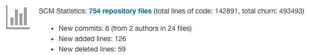

In this summary you will see how many files have been processed in total (with total LOC and code churn statistics) and 
how many new commits have been recorded in the current build. You will additionally see the added and deleted lines 
in these new commits. 

From the summary you can navigate to a separate plugin view, that shows the details for all of your repository 
files. In this view you see aggregation charts that show how many files have a small or large number of authors or 
commits, respectively. Additionally, you can see the individual statistics for all repository files in a table:  
- commits count
- different authors count
- creation time
- last modification time
- lines of code (from the commit details)
- code churn (changed lines since created)

Use the filtering or sorting capabilities of the table to highlight the most important files in your project. 

For all files an additional detail view is available, that shows the added and deleted lines by each commit. In this
view you can see a chart on the top showing the added (green) and deleted lines (red) for each commit. A table
at the bottom lists the individual commits that changed the selected file. From this table you can directly navigate 
to the Git commit details of your repository (if configured correctly).

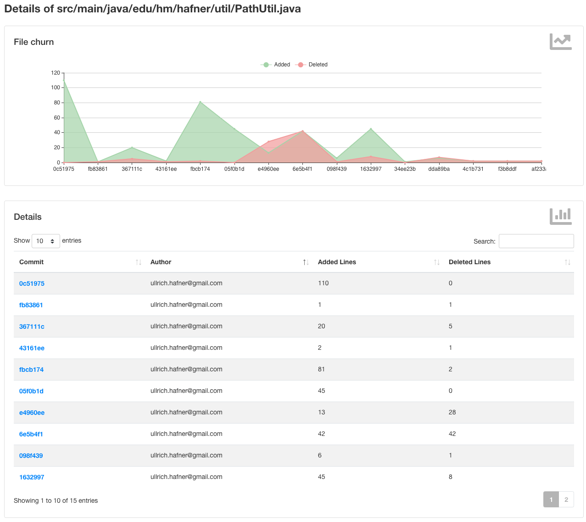

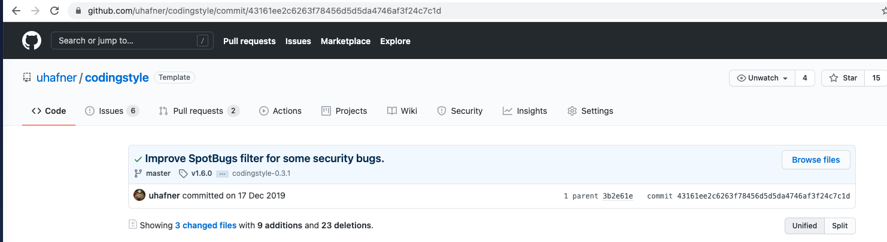
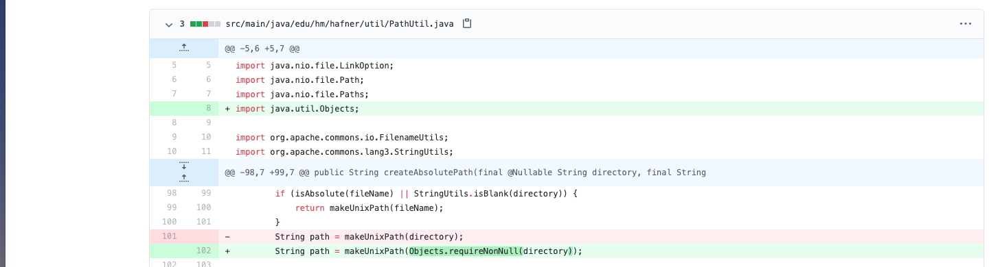

On the job level, the mining step also provides a trend chart for your Git commits. Your can choose from
one of the four different trend charts, see next section.

### Total number of files

The total number of files trend chart simply counts the number of files in your repository 
over the time.

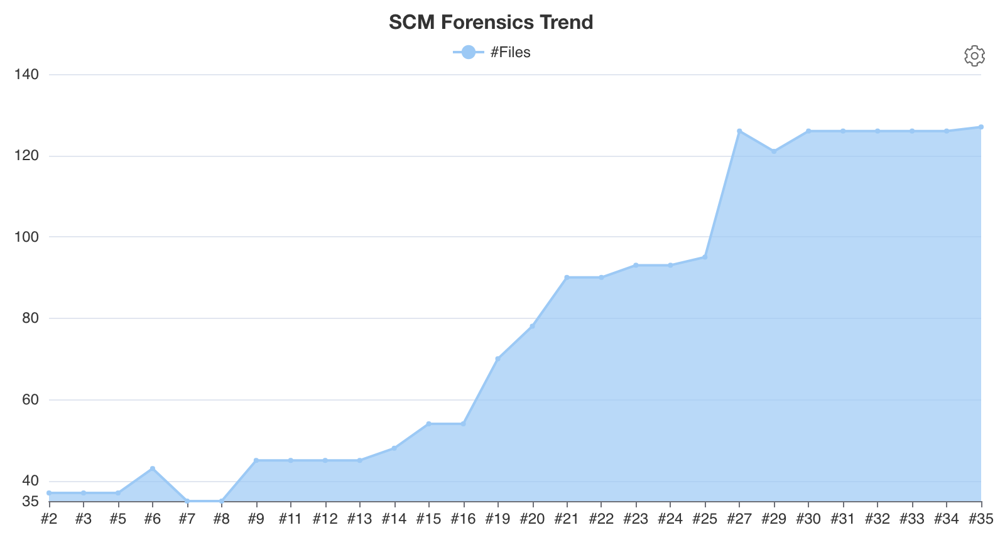

### Total lines of code and churn

The total lines of code and churn trend chart counts two different line statistics:

- **Lines of code**: the total number of source code lines in your repository is computed by subtracting the
  deleted from the added lines in the repository over the time. The result represents the actual
  volume of code in your project.
- **Churn**: the source code churn in your repository is computed by summing up the absolute values of deleted and 
added lines in the repository over the time. The result is a measure of activity and overhead in your source code base.
The smaller the gap between **Churn** and **Lines of code** the less code has been changed or thrown away during 
the project's lifetime.

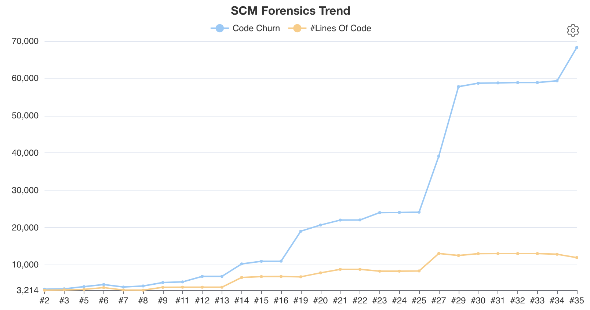

### Deleted and added lines

The deleted and added lines trend chart visualizes the delta between added or deleted lines in each build.
Using this chart your project easily can spot peaks where more or less code has been changed.    

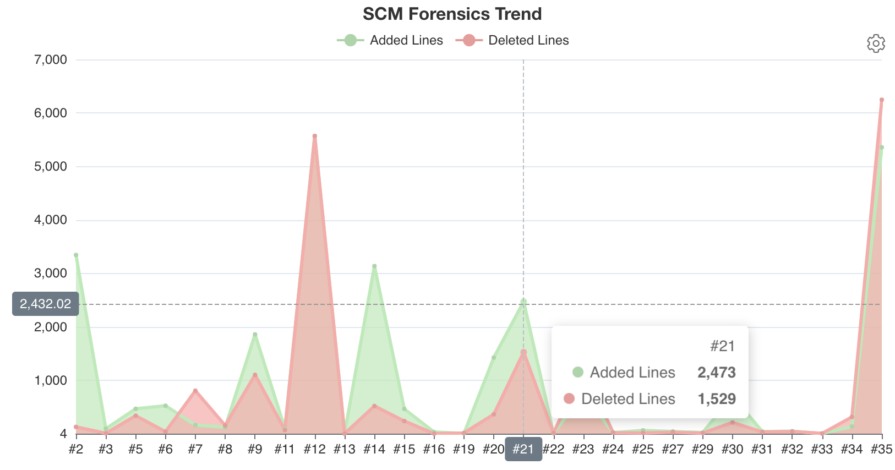

### Author, commit, and modified files count

Finally, the author, commit, and modified files count trend visualizes some additional  
information that might be helpful to keep your project in shape.

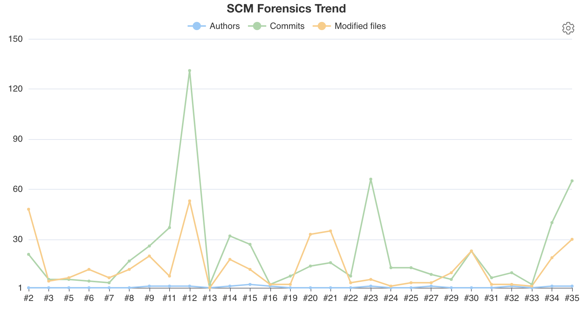

## Commit tracking

The Git Forensics plugin automatically tracks all new commits that are part of a build that uses a Git SCM. Using this 
information other plugins can search for builds that contain a specific commit. You can see the results of this
commit listener on the build status page:

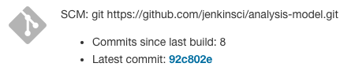

There you will see the number of new commits and a link to open the repository browser with the details of the latest commit. 

## Commit statistics

For pull requests (or more generally: for jobs that have a reference build defined) the Git Forensics plugin collects 
a statistical summary for all containing commits. 
This includes the commits count, the changed files count, and the added and deleted lines in those commits. 
This information will be available as a summary for each build: 

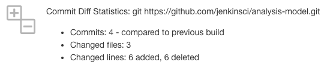

This information is also available for builds that do not have a reference build defined (see next section).
In this case the statistics since the previous successful build will be shown.

You can use this feature by enabling the pipeline step `gitDiffStat`.
On the job level, this step also provides a trend chart for your Git commits. Your can choose from
one of the following two trend charts, see next section.

### Deleted and added lines

The deleted and added lines trend chart visualizes the delta between added or deleted lines in each build.

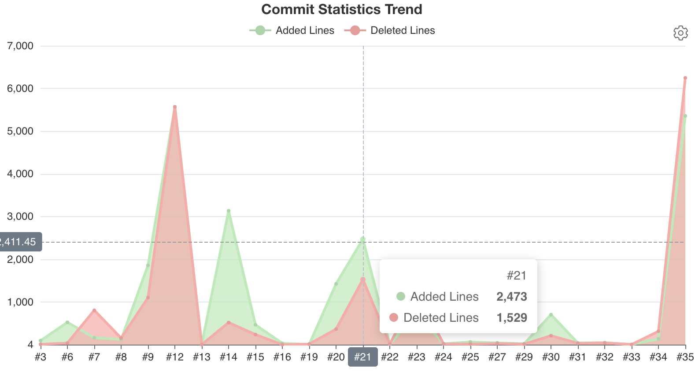

### Author, commit, and modified files count

Additionally, the author, commit, and modified files count trend visualizes in which way the files of a build 
have been changed.

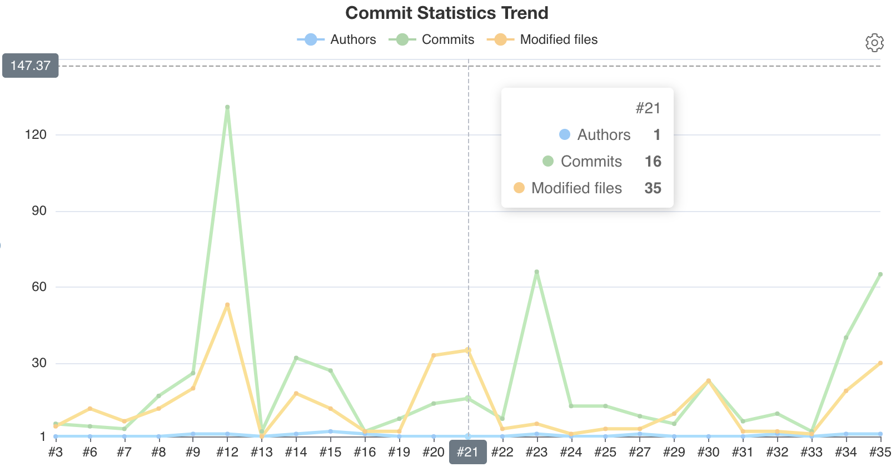

## Reference build 

Several plugins that report build statistics (test results, code coverage, metrics, static
analysis warnings) typically show their reports in two different ways: either as absolute report
(e.g., total number of tests or warnings, overall code coverage) or as relative delta report (e.g., additional tests,
increased or decreased coverage, new or fixed warnings). In order to compute a relative delta report a plugin needs
to carefully select the other build to compare the current results to (a so called *reference build*).
For simple Jenkins jobs that build the main branch of an SCM the reference build will be selected from one of the
previous builds of the same job. For more complex branch source projects (i.e., projects that build several branches
and pull requests in a connected job hierarchy) it makes more sense to select a reference build from a job
that builds the actual target branch (i.e., the branch the current changes will be merged into). Here one typically is
interested what changed in a branch or pull request with respect to the main branch (or any other
target branch): e.g., how will the code coverage change if the team merges the changes. Selecting the correct reference
build is not that easy, since the main branch of a project will evolve more frequently than a specific feature or bugfix
branch. 

Up to now Jenkins plugins compute these reference builds on their own, which leads to different results or 
duplicate code. The Git Forensics plugin tries to generalize these requirements and provides a new API for Jenkins plugins
to obtain such a reference build. This functionality is available after enabling the post build step 
*Discover Git Reference build* in your Freestyle project or by running the step `discoverGitReferenceBuild` in your 
pipelines. 

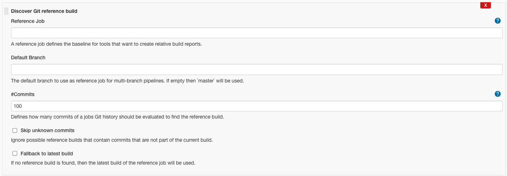

Discovering the reference build can be configured with several properties. The most important option is the 
`referenceJob`: The reference job determines the target branch of the project where all changes will be merged into. 
Then other plugins can use the best fitting build of this job as baseline for relative build reports that show 
the effects of a given change. In [multi branch pipelines](https://www.jenkins.io/doc/book/pipeline/multibranch/#creating-a-multibranch-pipeline) 
this name will be automatically retrieved from the pipeline configuration. If your pipeline uses more that one SCM you
can select the correct SCM with the `scm` parameter.

You can see the results of this computation (and the significant processing decisions) on the build details page: 

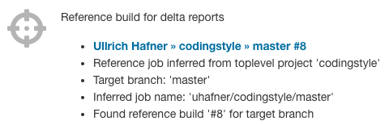
